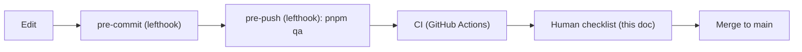

# Pre-merge / pre-publish review

The one place that answers "is this safe to merge?" Read it before you approve a PR or push to `main`. It exists because this repo is solo + AI-heavy: most changes never get a second human's eyes, so the *system* has to be the second reviewer.

The model is **defense in depth** — three automated layers catch the mechanical things, and a short human checklist catches the judgment calls automation can't. If all four pass, merge. If you skip a layer, say so in the PR body.



## Layer 1 — pre-commit (automatic, [lefthook.yml](../../lefthook.yml))

Runs on `git commit`, per staged file. You don't invoke it; it invokes you.

- **biome** — format + lint autofix, restaged automatically.
- **comment-quality** — rejects narrating comments (`// increment i`). Intent-only, per [.cursor/rules/070-comments.mdc](../../.cursor/rules/070-comments.mdc).
- **secretlint** — blocks committed secrets (Stripe/AWS/JWT/PAT/`.env` assignments). Allowlist: `.secretlintrc.json`.
- **commit-msg** — Conventional Commits (`scripts/commit-msg.sh`).

## Layer 2 — pre-push (automatic, [lefthook.yml](../../lefthook.yml))

Runs `pnpm qa` on `git push`: **lint → typecheck → knip → test → build**. This makes "qa is green locally" and "CI is green" the same statement. ~15–25s. Do not routinely `--no-verify` past it; if you must, explain why in the PR.

## Layer 3 — CI (automatic, [.github/workflows/](../../.github/workflows/))

Runs on every PR + push to `main`. Mirrors and extends the local gate:

- **ci.yml `verify`** — `pnpm qa` equivalent (lint, typecheck, knip, test, build). Keep this in lockstep with `pnpm qa`; if you add a `qa` stage, add the CI step.
- **ci.yml `e2e`** — Playwright (a11y axe scans + compliance smoke + feature specs) against a production `build && start`.
- **codeql.yml** — static security analysis.
- **lighthouse.yml** — performance / a11y / SEO budgets.

> Note: CI only runs once the repo is pushed to GitHub (see [docs/TODO.md](../TODO.md) 🔴). Until then, Layer 2 (pre-push `pnpm qa`) + this human checklist are the real gate.

## Layer 4 — human checklist (you, every merge)

The things no linter catches. Tick what applies; most PRs touch only a few.

### Always

- [ ] **Scope is one thing.** The PR does the one thing its title says. Unrelated drive-by edits get their own PR.
- [ ] **`pnpm qa` is green** locally (Layer 2 should have enforced this).
- [ ] **No `README.md` added** anywhere. Intent goes in code comments or `docs/adr/` (AGENTS.md rule).
- [ ] **Screenshots** attached for any UI change (before/after).

### Docs stay in sync (the most common drift)

- [ ] **[docs/feature-map.md](../feature-map.md)** updated if a route/table/admin surface/service was added, removed, or changed status (`scaffold`→`live`, etc.). This is the file someone reads to answer "what does this site do?" — stale rows erode it fast.
- [ ] **[docs/TODO.md](../TODO.md)** updated — close the item you finished; add follow-ups + their trigger/owner.
- [ ] **ADR added** in `docs/adr/NNNN-*.md` if a material architectural decision was made or changed. Reference it from the feature-map row.
- [ ] If a feature ships with an **unverified path** (e.g. a no-data fallback that hides an untested live path — the `/events` lesson), say so explicitly in the feature-map row + an ADR "Verification status" + a TODO. Don't let `live` imply "battle-tested" when it isn't.

### Compliance (legally significant — slow down here)

- [ ] No changes to `components/compliance/**`, `lib/org.ts`, or donation / application / transparency / receipt surfaces — **or** if there are, the wording was reviewed against [.cursor/rules/060-compliance.mdc](../../.cursor/rules/060-compliance.mdc) and the IRS determination / NY filings, by the treasurer.
- [ ] Tax-deductibility language (§501(c)(3)), EIN, and §174-B disclosure are untouched or deliberately + correctly changed.

### Accessibility (WCAG 2.2 AA, [.cursor/rules/050-accessibility.mdc](../../.cursor/rules/050-accessibility.mdc))

- [ ] New interactive routes added to `tests/e2e/a11y.spec.ts` ROUTES (axe scan).
- [ ] Keyboard reachable; visible focus ring preserved; 44px min targets; labels on inputs; color is never the only signal.

### Data layer / Supabase (when migrations or queries change)

- [ ] New migration is **additive + idempotent** where possible; follows the `000N_*.sql` convention; mirrored in [lib/supabase/types.ts](../../lib/supabase/types.ts).
- [ ] **RLS reviewed**: every new table has RLS enabled + at least one policy; anon can only read what's public; writes are service-role or `admin_users`-gated. Verify the *negative* case (anon write is blocked), not just the happy path.
- [ ] Migrations apply cleanly from scratch: `supabase db reset` succeeds. (See "Manual live-path verification" below for date/RLS-bearing features.)

### Server Actions / forms

- [ ] Follows [docs/checklists/server-action.md](server-action.md): Zod-validated input, typed `Result<T,E>` (never throws across the boundary), admin client only where a service-role intent is correct.
- [ ] One failure-per-error-code + one happy-path unit test.

### Brand / assets

- [ ] Follows [docs/checklists/asset-generation.md](asset-generation.md): no AI watermark, EXIF stripped, registered in `lib/brand/assets.ts`, no hard-coded `/brand/...` paths.

### Dependencies

- [ ] New dependency is justified (size, maintenance, license). Added via the package manager at a real version, not hand-edited.

## Manual live-path verification (for features with a no-data fallback)

Automated tests run against the fallback path (no Supabase). For a feature whose *value* is in the live DB path (events, opportunities, applications, donations), do a real round-trip before calling it done — this is exactly the gap that left `/events` "implemented but not battle-tested" until it was run by hand:

```bash
# Docker running, then:
supabase start
supabase db reset                 # asserts all migrations apply
export $(supabase status -o env | sed -E 's/^([A-Z_]+)=/\1=/' )   # or copy keys manually
pnpm seed:<feature>               # if a seed exists
# Verify the RLS boundary directly against the REST API:
#   anon SELECT returns public rows; anon INSERT/UPDATE returns 401/42501.
# Then render the live path through the app (a fresh server with the
# Supabase env set — NEXT_PUBLIC_* are inlined at build time, so build with
# the env, or use a dev server started with it).
```

Capture the result in the PR body (or the ADR's "Verification status") so the next reader knows the live path was actually exercised, not just the fallback.

## Release / publish to production

Beyond merging to `main`:

- [ ] Vercel preview deploy is green and visually spot-checked.
- [ ] Any new env var is set in Vercel (and documented in `.env.example`).
- [ ] If the change is gated on an external trigger (IRS determination, a key landing), it's tracked in [docs/TODO.md](../TODO.md) under the right status marker, not silently shipped half-on.
- [ ] OG cards / metadata render for new routes (`/<route>/opengraph-image`).

## Recommended next CI enhancement (not yet enabled)

The one automated gate we don't have yet, which would have caught the `/events` live-path gap automatically: a **migrations + live-smoke** CI job. Sketch, ready to enable once the repo is on GitHub (tracked in [docs/TODO.md](../TODO.md)):

```yaml
  migrations:
    runs-on: ubuntu-latest
    needs: verify
    steps:
      - uses: actions/checkout@v4
      - uses: supabase/setup-cli@v1
        with: { version: latest }
      - run: supabase start
      - run: supabase db reset            # fails if any migration is broken
      # optional: seed + curl the live path / assert RLS via the REST API
```

This turns "migrations apply + RLS holds" from a manual step into an automatic gate.
