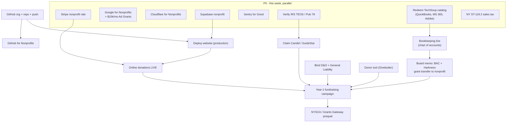

# Action plan — ranked, with dependencies

The "what next, in what order, and what's blocked by what" companion to
[`roadmap.md`](roadmap.md). The roadmap is the board narrative; this is the
operator's checklist. Status of the foundation as of **2026-07-15**: formation,
EIN, 501(c)(3) determination, board-adopted governance pack, banking, **CHAR410
registered (NYS Reg. No. 51-61-38)**, **990-N accepted**, **TechSoup validated**, and Drive
organized are all done. What follows is everything still open.

**Maintained by:** Eran Nussinovitch, Secretary & Treasurer

---

## Top priorities — re-ranked 2026-06-30

Re-ranked now that the foundation, live site, and a stack of free software (Google for
Nonprofits, Adobe, ChatGPT, Claude, TechSoup, Stripe) are in hand. Ordered by value × urgency ÷ effort.

**v2 adjustments (2026-06-30, after the Goodstack/TechSoup software review):**
- **ST-119.2 moved up** — docs drafted (Drive `03_NY-State`); only the `[CONFIRM]` financials remain. Near-term.
- **Website moved up** — deploy **incrementally behind feature flags** (repo already has `ORG.onlineGivingLive`, `irsStatus`): ship marketing/content first, gate donations/applications/opportunities. Worth a short phased plan.
- **Insurance recalibrated** — not an emergency at this size; **get quotes, bind before the next public event or the first time a venue/funder requires a Certificate of Insurance.** Arts-specific options: Fractured Atlas, Dance/NYC group rates.
- **Password manager = Bitwarden** (free, org-shareable, not tied to one Google account). Move the Stripe 2FA codes there.
- **Donations interim = Every.org** (free, reputable, auto receipts, DAF/stock; the widget the charter anticipated). Stripe stays the long-term in-app core.
- **Software sources:** use **both** Goodstack + TechSoup, avoid double-dipping the same product. TechSoup for **Microsoft 365 + QuickBooks Online (~$80/yr)**; Goodstack for the AI/creative/SaaS offers. Grab now: **Canva (free)**, **Bitwarden (free)**. Skip Microsoft/Azure stack (we're Google-centric). Don't over-apply — only take a tool when there's a real need.
- **Other nonprofit resources to tap:** Volunteer Lawyers for the Arts NY (free/low-cost legal), Dance/NYC + Dance/USA membership (intel + group rates), a newsletter tool (Mailchimp/Constant Contact nonprofit) to build the broad small-donor base, Google Business Profile + Analytics (free with GfN).
- **Note:** Goodstack ≠ Candid. Goodstack = software-discount verifier (+ a grant-search tool); Candid = the public nonprofit profile funders research. Want both.

### Tier 1 — this week (high value, mostly low effort)
1. **Lock down access ownership** — put org tools under org accounts/`hello@` (or Teams), not personal logins. *Pending Eran's Goodstack check of which email verified the org (OpenAI greeted "Lilach").* For Claude, sign up for Claude for Teams with that verified email.
2. **Bind D&O + General Liability insurance.** ⚠️ The 2026 cohort sharing (June 20–21) was a **public event already held without coverage** — close this gap ASAP. Save policies to Drive `09_Insurance`.
3. **Redeem TechSoup → QuickBooks Online; set up bookkeeping** (chart of accounts splitting programs vs admin vs fundraising). Needed before more money flows, for the grant-transfer memo, and for the 990.
4. **Activate Google Workspace for Nonprofits** (pending ~3-day review) → then **apply for Google Ad Grants ($10k/mo)** — highest-leverage reach; privacy page already live.

### Tier 2 — next 2–3 weeks (revenue + governance)
5. **Turn on giving now** — interim **Zeffy/Every.org donate button** on the landing page (don't wait for the full app); revisit Stripe-in-app at go-live (see Donation processing decision in operating-stack).
6. **Grant pipeline** — **subscribe Goodstack Grant Pro ($199/yr)** (queued ✅); use ChatGPT/Claude to draft; start the slow **NYSCA Grants Gateway prequalification**, plus **LMCC** + **NYC DCLA CDF** + dance funders (Mertz Gilmore, Jerome, NEFA NDP).
7. **Board housekeeping (July 13 meeting)** — ratify the BAC/Harkness grant-transfer memo, adopt a whistleblower policy, approve a Year-1 budget.
8. **Candid Seal of Transparency** — once Case #01013088 grants admin control, complete the profile.
9. **Mail NY ST-119.2** — finalize the `[CONFIRM]` financials and send the packet (Drive `03_NY-State`).
10. **Adopt a password manager** — move Stripe 2FA codes + secrets off Drive/Downloads.

### Tier 3 — engineering (when ready)
11. **GitHub org + repo + push → full website deploy** (Vercel vs Cloudflare adapter) → in-app Stripe donations + applications/opportunities.

> Leverage note: with ChatGPT + Claude now approved, drafting grant LOIs, applications, donor copy, and board docs is much faster — use them on Tier 2 #6–7.

---

## Recent milestones — 2026-07-15

- **Vercel Pro live + interim site deployed.** Stood up the org-owned **Vercel Pro** team (`motive-4-artists`, **$20/mo + tax ≈ $21.78/mo**); a duplicate Pro team created during signup was **deleted and refunded**. The full Next.js app now deploys automatically from `main` and ships in **review mode** (`NEXT_PUBLIC_SITE_MODE=review`) — a public, no-index content/design preview at **https://m4a-pi.vercel.app** with every service-dependent route (donate / apply / opportunities / events / admin / CMS / API) behind a real 404 and no newsletter. **No Supabase / Stripe / Resend account provisioned.** Shared with the board for content + visual-direction review ahead of the July 21 meeting. Decision record: **ADR 0009**; cost correction in ADR 0001. This advances P1 #9 / Tier 3 #11 — the *interim* half of "deploy the full website" is done; production go-live (repoint the domain + un-gate features) remains.
- **CI/CD green end-to-end** on `MOTIVE-4-ARTISTS/m4a` PR #13 (merged): lint / typecheck / unit / build (`ci`), `e2e`, `codeql`, `lighthouse`, plus a new **`preview-smoke`** workflow that runs a 33-check review-mode suite against each live Vercel deployment (`deployment_status`).

## Recent milestones — 2026-07-04

- **Stripe nonprofit pricing APPROVED** ✅ — `acct_1TnANUPdKNJwJlqG` is now on charity rates: **2.2% + $0.30** domestic, 3.2% + $0.30 international, 3.5% Amex (all card-not-present). Caveat from Stripe: the account must stay **primarily donations** (fine — studio rental runs through the LLC). This clears the last *external* blocker on in-app giving; the flag `ORG.onlineGivingLive` still waits on the full app being deployed + production Checkout verified. Enable **ACH** (0.8%, cap $5) for large gifts when we wire it.
- **GitHub for Nonprofits APPROVED** ✅ — activate the free **Team** plan at nonprofits.github.com. (Secret scanning, push protection, CodeQL, and Dependabot are already on — free because the repo is public; Team adds free private repos + more Actions minutes if we ever need them.)

## Recent milestones — 2026-06-30

- **Google for Nonprofits: ORGANIZATION VERIFIED** ✅ (Goodstack). Google Workspace **free-tier** activation submitted for motive4artists.org (~3-day review). Ad Grants ($10k/mo) is the next unlock (privacy page already live).
- **Free software approved via Goodstack/Percent (auto-suggested during signup):**
  - **Adobe** ✅ — 1-year free Adobe Express Premium + 1-year Acrobat Pro discount (activation links emailed to Eran).
  - **OpenAI / ChatGPT** ✅ — nonprofit discount approved (prorated credit + auto-applied; approval addressed to Lilach).
  - **Anthropic Claude for Nonprofits** ✅ — approved; discount applies when signing up for **Claude for Teams** with the email used to verify via Goodstack.
- **Stripe** — live account active (linked to Chase …3355); profile under standard 24-hour verification; nonprofit fee-discount application submitted via the portal.
- **Candid / GuideStar** — Case #01013088 still open (admin-authority bypass).
- ⚠️ **Access-ownership flag:** approvals are landing under different individuals (Adobe → Eran; OpenAI + Claude → Lilach). Where each tool allows it, set up under an **org account / `hello@`** (or a shared/Teams workspace) so access isn't tied to one person — same lesson as the domain. For **Claude**, sign up for Claude for Teams with the Goodstack-verified email (confirm which; prefer `hello@`).
- **Goodstack Pro (grant tooling) — decision parked:** free plan has 2 searches left. Paid tiers: **Grant Pro $20/mo or $199/yr** (unlimited AI grant search + application-writing), Agent Basic $99/mo (2 drafted apps/mo), Agent Pro $299/mo (10 apps/mo + automated sourcing/outreach). Revisit when actively grant-writing; Grant Pro $199/yr is the likely first step.

- **GitHub: org + first push done.** Account converted to an **Organization** (github.com/MOTIVE-4-ARTISTS); repo `m4a` org-owned. **Code pushed to `MOTIVE-4-ARTISTS/m4a` (origin/main) 2026-06-30**, authed as org-owner `MOtiVE4ARTists`; pre-push `qa` suite (lint/typecheck/knip/test/build) passed. **`out-there-dev` removed everywhere** (gh logged out, stale plaintext credential cleared, not a repo collaborator). Remote updated old→new org name; `landing/` gitignored (stays Cloudflare-only). **GitHub for Nonprofits applied 2026-06-30** (~10-day review → free Team). Next: hosting decision → connect Vercel → deploy.

## Recent milestones — 2026-06-27 (evening)

- **Live site finalized on the real domain** — `https://motive4artists.org` (+ `www` 301-redirecting to apex) serving the landing page with valid SSL. Homepage now carries an "our work" track record (since 2021, 100+ artists, 6 cohorts, Bergen exchange, Harkness + Brooklyn Arts Council) plus a clearly-labeled link to the MOtiVE Brooklyn archive (Instagram + motivebrooklyn.com/artists-we-support) for independent verification.
- **Privacy policy live** at `https://motive4artists.org/privacy/` (linked in footer) — accurate to the static site; pre-positioned for the Google Ad Grants requirement.
- **Google for Nonprofits verification SUBMITTED** (via Goodstack) — follow-up to `hello@motive4artists.org`; 2–14 business days. If asked for a document, send the determination letter (Drive `02_IRS-Federal`). On approval, unlocks Google Workspace for Nonprofits + Ad Grants ($10k/mo).
- **Candid / GuideStar claim escalated to human support** — **Case #01013088** (2026-06-28); attached IRS CP-575 + adopted officer-election resolution to prove admin authority. Awaiting review; target the Seal of Transparency once control is granted.

## Recent milestones — 2026-06-27 (earlier)

- **IRS TEOS / Pub 78 verified** — listed on Pub 78 (deductibility code PC); determination letter visible. Unblocks the Candid claim.
- **Domain ownership consolidated** — `motive4artists.org` moved from a personal Cloudflare account into the **org-owned `hello@motive4artists.org`** Cloudflare account via Cloudflare's inter-account registrar transfer. Google Workspace email/MX preserved (DNS exported + re-imported first). Nameserver propagation (`graham`/`lia` → `gina`/`miguel`) in progress; zone goes Active when done.
- **Interim website LIVE on the real domain** — static landing page (legal name, artist-first mission, four programs, multi-year track record, EIN footer) deployed to **Cloudflare Pages** (free) and serving at **https://motive4artists.org** + **https://www.motive4artists.org** with valid SSL (apex + www custom domains attached to the `motive4artists` Pages project in the org account). Meets the Google for Nonprofits "live website" requirement. Source in [`landing/`](../../landing/index.html).
- **Cloudflare MCP configured** in `~/.cursor/mcp.json` (loads after a Cursor restart) for direct Pages/DNS management going forward.

---

## Dependency map

---

## P0 — this week (mostly independent, run in parallel)

1. **Redeem the TechSoup catalog** — validation cleared 2026-06-25 (code 4149-ISTS-3LQB).
   Pull QuickBooks Online, Microsoft 365, and Adobe. Save confirmations + validation tokens
   to Drive `08_Tech-Accounts`. *Depends on: nothing (done gate).*
2. **Apply to the independent nonprofit programs** (no TechSoup needed):
   Google for Nonprofits (turn on the **$10k/mo Ad Grants** — highest-leverage item),
   Cloudflare for Nonprofits, Supabase nonprofit discount, Sentry for Good,
   and **Stripe nonprofit rate** (`nonprofit@stripe.com`). *Depends on: determination (done).*
3. ~~**Verify the IRS TEOS / Pub 78 listing**~~ — ✅ DONE 2026-06-27 (on Pub 78, deductibility
   code PC; determination letter listed). Unblocks the Candid claim.
4. **File NY ST-119.2** (sales-tax exemption) — free; stops sales tax on purchases.
   Form is filled and verified; assemble the mailing packet (see the ST-119.2 Drive folder)
   and mail to the NYS Tax Department, Exempt Organizations Unit, Albany.
5. **Stand up bookkeeping** in QuickBooks (from step 1): a chart of accounts that separates
   program costs (Residency / Exchange / Space Subsidy / Pedagogies) from admin + fundraising.

## P1 — next 2–4 weeks (sequenced)

7. **Create the GitHub org + repo and push the code** (`docs/TODO.md` 🔴). Gates the website
   deploy and the GitHub for Nonprofits application.
8. **Apply to GitHub for Nonprofits** (free Team) once the org exists. *Depends on: 7.*
9. **Deploy the full website to production.** *Depends on: 7 + Supabase (step 2) + `.env`.* An
   interim static landing page is already live on Cloudflare Pages (see milestones above); this
   item is the full Next.js app (donate / apply / opportunities). Decide Vercel (Plan A) vs. the
   Cloudflare Pages adapter (Plan B), then point `motive4artists.org` at it.
10. **Turn on online donations.** *Depends on: 9 + Stripe nonprofit account (step 2).* Flip
    `ORG.onlineGivingLive` once the production Stripe account is verified.
11. **Board memo: grant transfer.** Minute the recognition of the $5,000 Brooklyn Arts
    Council + $2,500 Harkness grants (applied for as MOtiVE Brooklyn) as income of the
    nonprofit — a clean arm's-length, related-party record. *Depends on: 6.*
12. **Claim Candid / GuideStar**, aim for the Seal of Transparency. *Depends on: 3.*
13. **Bind D&O + General Liability insurance.** D&O protects directors personally; do it
    before the next public event. Save to Drive `09_Insurance`.

## P2 — 1–3 months

14. **Pick a password manager + document vault**; move `founding-record.secret.md` into it.
15. **Stand up a donor tool** (Givebutter recommended — free, handles matching-gift prompts).
16. ✅ **Recorded the CHAR410 registration** — Bureau issued **NYS Reg. No. 51-61-38** (registered 2026-06-25). Public verification remains in the Charities Registry; the site repeats only the solicitation disclosures the law requires.
17. **Adopt a whistleblower policy** (one-pager; pairs with the COI policy — funder-friendly).
18. **Launch the year-end / Giving Tuesday campaign** ("breadth beats depth": a wide base of
    $15–$50/mo recurring donors). *Depends on: 10, 12, 13, 15.*

## P3 — 3–12 months

19. **NYSCA / Grants Gateway prequalification** — slow, document-heavy; start early. (Board
    set a $20k year-end fundraising goal partly to qualify for NYSCA in 2028.)
20. **Build the grant calendar** — Harkness renewal cadence + new dance/arts funders.
21. **Track the public-support ratio** from day one (test first bites FY2031).

---

## Registrations, listings & enrollments backlog

Beyond ST-119.2, these are the "do it once, benefit for years" registrations worth pursuing,
grouped by payoff. Most unblock now that we're on Pub 78 / have a determination letter.

### Saves money (tax-exempt purchasing) — after the EX number arrives

- **Vendor tax-exempt accounts** using the NY EX-###### number: **B&H Photo** (also fix the
  account name to the corporation), **Amazon Business** (Amazon Tax Exemption Program / ATEP),
  Staples/Office Depot, Apple, Home Depot. One-time setup, recurring savings.
- **Nonprofit software discounts** beyond TechSoup: **Canva for Nonprofits** (free), Zoom
  nonprofit, Notion/Slack nonprofit, Calendly nonprofit.

### Unlocks fundraising reach (do once on Pub 78)

- **Candid / GuideStar profile + Seal of Transparency** — the master record nearly every
  funder and giving platform reads from. Highest priority; gates the items below.
- **PayPal Giving Fund** and **Meta (Facebook/Instagram) fundraising tools** — enroll the
  nonprofit (verified via Candid/our determination) to enable **Instagram donation stickers**
  and in-app giving — a natural fit for our audience.
- **Corporate matching-gift networks** — Benevity, Bright Funds, Frontstream — so employees
  of companies that match gifts can route matched donations to us.
- **Confirm DAF-eligibility** (donor-advised funds) — flows from being on Pub 78.

### Grants infrastructure (start the slow ones early)

- **NYSCA via the Grants Gateway / SFS prequalification** (already P3 #19) — required before
  you can even view most NY State grant cycles.
- **LMCC (Lower Manhattan Cultural Council)** — administers NYSCA + NYC DCLA **regrants for
  Manhattan-based** artists/orgs; our office is in Manhattan (10009), so we likely qualify.
- **NYC DCLA Cultural Development Fund (CDF)** — NYC's open cultural grant cycle.
- **Dance/movement funders** — Mertz Gilmore, Jerome Foundation, NEFA National Dance Project,
  plus the existing Harkness + Brooklyn Arts Council relationships.
- **SAM.gov UEI** — only if/when pursuing federal grants.

### Lower priority / situational

- **Charity Navigator** — auto-rates after several 990s; claim the profile later.
- **USPS Nonprofit Marketing Mail** rate — only if we do bulk physical mail.
- **USPTO trademark** for "MOtiVE 4 Artists" — optional brand protection given the
  LLC/brand-family overlap.
- **Multi-state charitable-solicitation registration** — only if we actively solicit beyond
  NY (a passive online Donate button generally doesn't trigger it under the Charleston
  Principles). Revisit before any national campaign.

---

## Recurring dates — calendar invites

These are created as recurring events on the org Google Calendar (see the calendar
for reminders). Source of truth for cadence: [`compliance-calendar.md`](compliance-calendar.md).

| Event | Cadence | Next |
|---|---|---|
| IRS Form 990 series due | Annual | 2027-05-15 |
| NY CHAR500 due | Annual | 2027-05-15 |
| NY DOS biennial statement | Every 2 years | 2028-03 ($9) |
| Board annual meeting | Annual | per bylaws |
| Director COI re-disclosure | Annual | per COI policy |
| Next scheduled board meeting | one-off | 2026-07-13, 9:00–10:30 AM ET |
| Google Ad Grants active-use check | Monthly | once approved |
| Insurance + domain renewals | Annual | once bound/registered |

---

## What we already planned vs. what's new here

- **Already in the plan of record:** the determination-day free-service batch, website
  deploy, online giving, CHAR410, the compliance calendar.
- **New / sharpened in this pass:** the 990-N period verification, the BAC/Harkness grant
  transfer memo (related-party hygiene), explicit GitHub-before-deploy sequencing, the
  Candid-after-TEOS dependency, insurance before first public event, and turning the
  recurring filings into actual calendar reminders.
