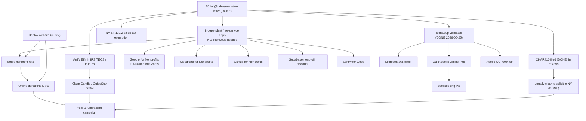
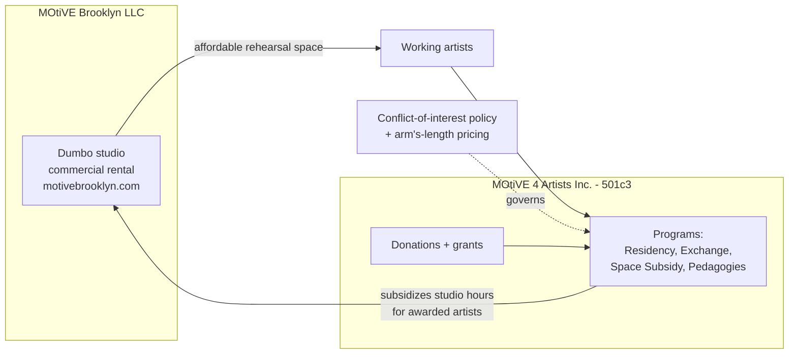
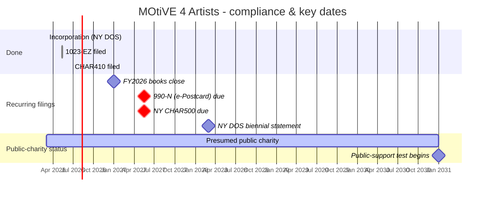

# Strategic roadmap — board view

A single board-shareable picture of where **MOTIVE 4 ARTISTS INC.** stands: what's done,
what we're waiting on, what depends on what, and where we go next — on both the
bureaucratic and the mission side.

This is the *synthesis* doc. The records of truth it sits on top of:

- [`formation-record.md`](formation-record.md) — the corporate paper trail (incorporation, EIN, 1023-EZ, classification, document index)
- [`compliance-calendar.md`](compliance-calendar.md) — recurring filing cadence
- [`operating-stack.md`](operating-stack.md) — back-office services, insurance, advisors
- [`../TODO.md`](../TODO.md) — engineering + "determination-day" task batch

**Maintained by:** Eran Nussinovitch, Secretary & Treasurer
**Last updated:** 2026-06-24

---

## 1. Executive summary

We are through the hardest, slowest part. MOtiVE 4 Artists is a New York not-for-profit
corporation with **federal 501(c)(3) public-charity status** (effective retroactively to
our 2026-03-02 formation), a complete and **board-adopted governance pack**, a funded bank
account, and — as of **2026-06-24** — a **filed New York Charities Bureau registration
(CHAR410)**, now in review.

The organization has shifted from *formation* to *operations and fundraising*. The next
chapter is about three things: (1) turning on the free and discounted infrastructure our
exempt status now entitles us to, (2) getting the public website live so we can accept
online donations, and (3) building the broad, small-dollar donor base that both funds the
mission and protects our public-charity status down the road.

Two June wins since this doc began: **TechSoup approved our validation (2026-06-25)** and
our **IRS Form 990-N was accepted (2026-06-25)**. TechSoup now unlocks Microsoft 365,
QuickBooks, and Adobe — but most other free-service applications (Stripe, Google,
Cloudflare, GitHub, Supabase, Sentry) never needed TechSoup and can all be filed today, in
parallel. See §6.

---

## 2. Status at a glance

| Area | Status | Note |
|---|---|---|
| NY incorporation | ✅ Done | DOS ID 7848002, filed 2026-03-02 |
| Federal EIN | ✅ Done | 41-4910645 |
| 501(c)(3) determination | ✅ Done | Effective 2026-03-02 (retroactive) |
| Governance pack (bylaws, COI, minutes, disclosures, resolutions) | ✅ Done | Board-adopted 2026-04-24 / 2026-05-01 |
| Banking | ✅ Done | Chase business account, $3,000 seed |
| Entity spin-out (LLC vs nonprofit) | ✅ Done | Clean legal separation |
| IRS 990-N (first annual e-Postcard) | ✅ Done | Accepted 2026-06-25 (TY2025); next 990-N due 2027-05-15 |
| TechSoup validation | ✅ Done | Qualified 2026-06-25 (code 4149-ISTS-3LQB); MS 365 / QuickBooks / Adobe now redeemable |
| NY Charities registration (CHAR410) | 🟦 In review | Filed 2026-06-24; registration # pending |
| Google for Nonprofits | ✅ Done | Verified 2026-06-30; Workspace free-tier activation pending (~3-day); Ad Grants next |
| Nonprofit software approvals | 🟧 In progress | Adobe / ChatGPT / Claude ✅ 2026-06-30; **Stripe nonprofit pricing ✅ 2026-07-03 (2.2% + $0.30)**; **GitHub for Nonprofits ✅ 2026-07-04 (select Team plan)**; Supabase/Sentry deferred to app deploy |
| NY sales-tax exemption (ST-119.2) | 🟥 Not started | Form filled + verified; mail the packet (Drive `03_NY-State`) |
| IRS TEOS / Pub 78 listing verified | ✅ Done | Verified 2026-06-27 — Pub 78 (deductibility code PC) + determination letter listed |
| Candid / GuideStar profile | 🟦 In review | Claim escalated — Case #01013088 |
| Public website | 🟧 Interim live | Landing page live at https://motive4artists.org (+ www) on Cloudflare Pages, org-owned account, SSL valid; full Next.js app still pending |
| Online donations | 🟥 Blocked | Stripe nonprofit rate ✅ 2026-07-03; still needs the full app deployed + Checkout verified, then flip `onlineGivingLive` |
| Insurance (D&O / general liability) | 🟥 Not started | Bind before first public event |
| Bookkeeping / accounting | 🟥 Not started | Engage before first 990 |

Legend: ✅ done · 🟦 in review / waiting on a third party · 🟧 in progress · 🟥 not started

---

## 3. What's done

The legal and governance foundation is complete:

- **Corporate formation** — Domestic Not-for-Profit Corporation, New York (DOS ID 7848002,
  file number 260303000632, filed 2026-03-02). Certificate carries full §501(c)(3) language.
- **Federal EIN** — 41-4910645.
- **Form 1023-EZ → determination** — filed 2026-05-12, recognized as a §501(c)(3) **public
  charity** under §509(a)(1) / 170(b)(1)(A)(vi), NTEE **A60 (Performing Arts)**, exemption
  effective **2026-03-02** (retroactive to formation).
- **Governance pack — adopted by the board:** bylaws, conflict-of-interest policy,
  organizational meeting minutes, all three director COI disclosure forms, the
  officer-election resolution, and the bank-account authorization resolution.
- **Banking** — Chase business account opened and seeded with a $3,000 startup transfer.
- **Entity spin-out** — the commercial studio-rental operation (MOtiVE Brooklyn LLC) and
  the charitable programming (MOtiVE 4 Artists Inc.) are now cleanly separated. See §7.
- **NY Charities Bureau registration (CHAR410)** — filed and paid ($25) on 2026-06-24;
  now under Bureau review.
- **IRS Form 990-N** — first annual e-Postcard **Accepted 2026-06-25** (TY2025); next due
  2027-05-15.
- **TechSoup** — organization **validated 2026-06-25** (association code 4149-ISTS-3LQB);
  Microsoft 365, QuickBooks Online, and Adobe are now redeemable from the catalog.
- **Grants** — $5,000 Brooklyn Arts Council + $2,500 Harkness (applied for as MOtiVE
  Brooklyn pre-formation; to be recognized as nonprofit grant income — see risk register).

Detail and reference numbers live in [`formation-record.md`](formation-record.md).

---

## 4. What we're waiting on (someone else's desk)

| Item | Who holds it | What it unblocks |
|---|---|---|
| **CHAR410 registration number** | NY AG Charities Bureau | Surfacing the registration # on the website `/transparency` page; clean record for funders |

This doesn't block the work in §6. (TechSoup validation cleared on 2026-06-25 — its catalog
offers are now redeemable.)

---

## 5. Critical-path dependency map

The takeaway: the determination letter already unlocked four parallel tracks. Only the
**Microsoft / QuickBooks / Adobe** branch genuinely waits on TechSoup. **Online donations**
is the one chain with a real internal dependency — it needs the website deployed and a
verified Stripe nonprofit account.

---

## 6. The big unlock — do this now (1–2 weeks)

These are independent applications. File them in parallel; none requires TechSoup.

| Apply to | Why | Depends on TechSoup? |
|---|---|---|
| **Stripe nonprofit rate** (via support fee-discount form) | Drops fees to 2.2% + $0.30; required for online giving | ✅ 2026-07-03 |
| **Google for Nonprofits** | Free Workspace **+ $10,000/month Google Ad Grants** (free search ads) | No |
| **Cloudflare for Nonprofits / Project Galileo** | Free enterprise security/CDN | No |
| **GitHub for Nonprofits** | Free Team plan | ✅ 2026-07-04 (select Team plan) |
| **Supabase nonprofit discount** | 40–80% off Pro (database/auth) | No |
| **Sentry for Good** | Free error monitoring | No |
| **NY ST-119.2** | Stop paying NY sales tax on purchases | No |
| **Verify IRS TEOS / Pub 78 listing** | Lets donors + verifiers confirm deductibility; feeds Candid | No |
| **Claim Candid / GuideStar** (after TEOS) | Grantmakers check this first; aim for the Seal of Transparency | No |
| **TechSoup membership** ($175/yr) | Unlocks Microsoft 365 free, QuickBooks $80/yr, Adobe 60% off | **Yes** |

> The single highest-leverage item here is **Google Ad Grants**: $10,000/month of free
> search advertising for nonprofits. For an organization our size that is transformative
> reach for the cost of setting up a few ad campaigns.

---

## 7. How the two entities fit together

A frequent funder and reviewer question. The structure is deliberate and the guardrail is
our adopted conflict-of-interest policy.

The nonprofit raises charitable funds and runs programs. When the Space Subsidy program
awards studio hours, those hours are used at the LLC's studio. Because the entities share
people, this is a **related-party transaction** — legal and common, but it must stay
arm's-length and be disclosed. Our COI policy is the control; the board reviews it
annually. (For external audiences like TechSoup, we describe the *charitable activity*
— subsidizing rehearsal space — not the inter-entity plumbing.)

---

## 8. Roadmap by horizon

### Now → 2 weeks

- **Bureaucracy:** fire off the §6 free-service batch in parallel; file ST-119.2; verify
  TEOS/Pub 78; store the determination letter + CP-575 scans in a chosen vault.
- **Mission:** finalize the just-completed 2026 AIR cohort wrap (the June 20–21 sharing);
  capture photo/video for the site and grant reports.

### 1 → 3 months

- **Bureaucracy:** TechSoup → QuickBooks; set up bookkeeping with a clean chart of accounts
  that separates program costs (Residency / Exchange / Space Subsidy / Pedagogies) from
  general admin and fundraising; **bind D&O + general-liability insurance**; engage a
  bookkeeper (and explore pro-bono counsel via Volunteer Lawyers for the Arts, vlany.org);
  surface the CHAR410 registration number on `/transparency` once issued.
- **Mission:** **deploy the website** and turn on online donations; launch a year-end /
  Giving Tuesday appeal; migrate the motivebrooklyn.com archive (past cohorts, artist bios,
  exchange roster) into the new site; claim the Candid Seal of Transparency.

### 3 → 12 months

- **Bureaucracy:** begin **NYSCA / Grants Gateway prequalification** (slow, document-heavy —
  start early); adopt an annual board calendar (meetings, COI re-disclosure, budget).
- **Mission:** run the **"breadth beats depth"** fundraising strategy — a wide base of small
  recurring donors ($15–$50/mo) alongside anchor grants; formalize the grant calendar
  (Harkness as the anchor, plus NYSCA and dance-specific funders); open the 2027 Residency
  and International Exchange application cycles.

### Annual + 5-year

- **990-N** (e-Postcard) and **NY CHAR500** — both due **2027-05-15** for FY2026.
- **NY DOS biennial statement** — March 2028 ($9).
- **Public-support test** — first bites **FY2031** (Schedule A, rolling 5-year window). We
  are a presumed public charity through 2030; track the ratio from day one anyway.

---

## 9. Mission roadmap

| Program | Status | Next |
|---|---|---|
| **Artist in Residency (AIR)** | 2026 cohort of nine; public sharing held June 20–21, 2026 (supported by The Harkness Foundation for Dance) | Document outcomes; open 2027 cycle late 2026 |
| **International Exchange** | Ongoing; anchor partner Bergen Dansesenter (Norway) | Plan next exchange; recruit a second partner org |
| **Discounted / Space Subsidy** | Rolling awards; studio at MOtiVE Brooklyn | Fund via donations; track utilization for impact reporting |
| **Pedagogies in Practice** | Rolling | Recruit teaching artists; produce + market first cohort of classes |

Supporting work: migrate the full historical archive (2021/2022/2023/2025/2026 cohorts +
artist bios + exchange roster) from motivebrooklyn.com into the site to make our multi-year
track record publicly visible — this is also what makes verifiers (TechSoup, Candid,
funders) able to confirm our activity independently.

---

## 10. Nonprofit tips, tricks & hacks

Low-cost, high-leverage moves available to us specifically because we're a 501(c)(3):

- **Google Ad Grants** — $10,000/month in free search ads (via Google for Nonprofits).
- **TechSoup catalog** — deeply discounted Microsoft 365, QuickBooks, Adobe, Box, Asana.
- **Employer matching gifts** — many donors' employers double gifts; surface a "does your
  employer match?" prompt at donation time (tools: Double the Donation, Givebutter).
- **Year-end + Giving Tuesday** — the bulk of US individual giving lands in Q4; plan a
  campaign around it.
- **Donor-advised funds (DAFs)** — make sure we can receive DAF grants; a large and growing
  channel for mid-size gifts.
- **100% board giving** — every director making a gift (any size) is a signal foundations
  look for; it strengthens grant applications.
- **In-kind + volunteer-hour tracking** — donated services and volunteer time support the
  impact story and, properly documented, help the public-support picture.
- **Candid Seal of Transparency** — Bronze→Silver→Gold; many funders filter by it.
- **Fiscal-year-end timing** — our Dec 31 year-end aligns with the Q4 giving season.
- **State charitable registration** — if we ever solicit nationally (online "Donate"
  buttons can count), some states require registration; revisit before a national push.

---

## 11. Risk register

| Risk | Severity | Mitigation |
|---|---|---|
| **Related-party transaction** (subsidy → LLC studio) | High | Adopted COI policy; arm's-length pricing; annual board review; external messaging describes charitable activity, not inter-entity flow |
| **Public-support test** (future) | Medium | Build broad small-donor base now; monitor single-donor 2% cap; presumed safe through 2030 |
| **No insurance yet** (D&O / GL) | High | Bind before first public event; D&O protects directors personally |
| **Key-person concentration** | Medium | Small board/volunteer team; document processes; recruit additional directors/volunteers |
| **Website not live** | Medium | Deploy; until then `/donate` runs the interim email/check path; CHAR410 Website field left blank intentionally |
| **Secrets / document vault not chosen** | Medium | Pick a password manager + document store; move `founding-record.secret.md` off local disk |
| **Annual filing lapse** | High | Three consecutive 990 misses = automatic revocation; calendar in [`compliance-calendar.md`](compliance-calendar.md) |

---

## 12. Compliance timeline

Threshold triggers that change the filing (gross receipts >$50k → 990-EZ; >$200k or assets
>$500k → full 990; >$1M → NY audit requirement) are tracked in
[`compliance-calendar.md`](compliance-calendar.md).

---

## 13. Open decisions for the board

1. **Insurance** — approve binding D&O + general-liability coverage before the next public
   event. (D&O is the priority; it protects directors personally.)
2. **Accountant / bookkeeper** — engage one before the first 990; decide QuickBooks (via
   TechSoup) vs. a managed bookkeeper.
3. **Pro-bono legal** — pursue Volunteer Lawyers for the Arts (vlany.org)?
4. **Secrets + document vault** — choose a password manager and a "Founding Docs" store.
5. **Inbox consolidation** — keep `dream@motivebrooklyn.com` (LLC) separate from
   `hello@motive4artists.org` (nonprofit), or consolidate?
6. **Online giving go-live** — confirm when to flip the website to live Stripe checkout
   (after the nonprofit Stripe account is verified).
