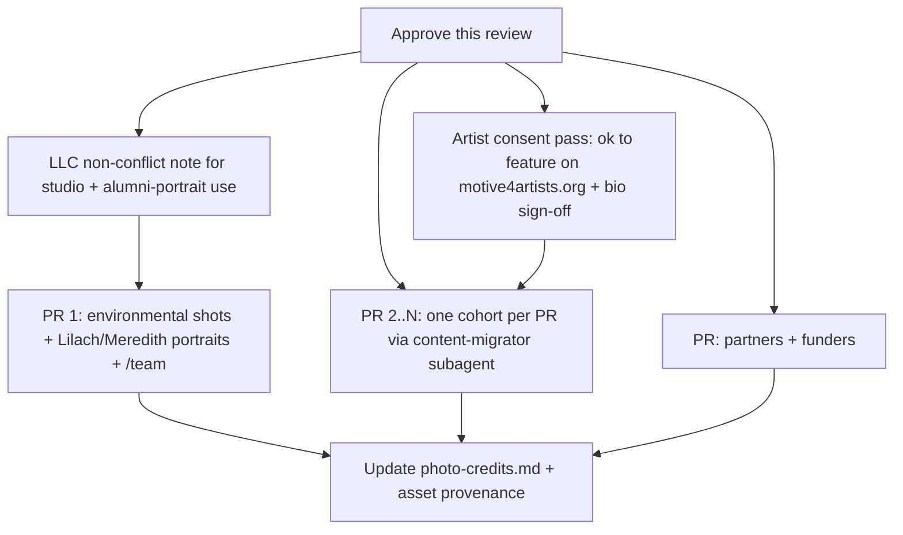

# Legacy content inventory + reuse review (motivebrooklyn.com + Instagram)

- Date: 2026-06-22 (updated same day to fold in the Instagram archive)
- Author: intake pass (Cursor agent), for Eran's review
- Status: **review only** — nothing migrated yet. This doc is the decision surface; migration runs as a follow-up once the reuse calls below are approved.
- Sources captured: **both** `motivebrooklyn.com` (site) and the `@motivebrooklyn` Instagram archive (pulled via gallery-dl, not the Meta export).

## Why this exists

`motive4artists.org` (the nonprofit) is starting from near-zero visual content. The May 2026 design audit ([design-audit-2026-05.md](design-audit-2026-05.md) §8) names "**no dancer/artist photography anywhere**" as the single biggest visual gap, and [docs/TODO.md](../TODO.md) Tier D already lists migrating the MOtiVE Brooklyn archive (cohorts, bios, partners) as planned content work. The LLC sibling `motivebrooklyn.com` and its Instagram are the obvious source of real, on-brand imagery to replace the current AI-generated placeholder brand surfaces and fill the empty Keystatic collections.

This pass captured that archive into a gitignored scratch area and inventoried it so we can decide, asset by asset, what to reuse.

## What was captured + where it lives

Raw material is staged under `_source-archive/` (gitignored — per the [asset playbook](../checklists/asset-generation.md) §3, raw dumps are never committed; only curated, processed assets land in `public/content/`).

| Source | Captured | Location |
|---|---|---|
| `motivebrooklyn.com` (public Squarespace) | 199 pages of HTML + extracted copy | `_source-archive/squarespace/html/`, `index.json` |
| Site images | 486 unique content images (544 files incl. og duplicates), full-res `?format=1500w`, organized per page | `_source-archive/squarespace/images/<slug>/` |
| Video embeds | 2 (referenced by URL, not downloaded) | `_source-archive/squarespace/links.json` |
| Structured buckets | cohorts -> artists -> portrait/credit/links | `_source-archive/squarespace/buckets.json` |
| Instagram (gallery-dl) | **340 media** (328 images + 12 videos) across **300 posts**, each with a JSON sidecar (caption, date, post URL, hashtags, location, tagged users) | `_source-archive/instagram/gallery-dl/instagram/<account>/` |
| Instagram index | posts grouped by shortcode + flat media list + tagged-user frequency | `_source-archive/instagram/ig-index.json` |
| Site <-> IG cross-reference | per-artist IG matches, video list, partner-account posts | `_source-archive/squarespace/crossref.json` |

Throwaway intake tooling also lives there: `extract.py` (HTML -> structured index), `download.py` (image stager), `bucket.py` (destination bucketer), `instagram/ingest.py` (gallery-dl **and** Meta-DYI indexer), `crossref.py` (site <-> IG matcher).

## Instagram: captured (gallery-dl, no export wait)

The IG archive was pulled directly with gallery-dl (per-media JSON sidecars), so we did not need the Meta export. `ingest.py` indexes it; re-run any time the archive grows.

| Account | Posts/media | Role |
|---|---|---|
| `@motivebrooklyn` | 322 media | The org's own feed — the primary source |
| `bergendansesenter` | 4 | International partner (Norway) — collab/tagged |
| `art.irka`, `lindenmovementlab`, `circlusion`, `studiospaceart`, `savannahjadedobbs`, `adrienne.westwood.projects` | 1–4 each | Collab/co-owned posts — feed partners/cohorts buckets |

**The big unlock: IG fills the bio gap the site couldn't.** The site's artist pages were portrait + link only. IG's "welcome / introducing / meet our resident" posts carry **full artist bios** in the caption. Cross-referencing tagged users + names against the 129 site artists:

- **122 of 129** site artists have at least one matching IG post.
- **115 of 129** gain a real bio-bearing IG post (the prose the `artists` schema needs). Example — iele paloumpis: *"a visually impaired dance artist, herbalist, astrologer and end of life doula living in Canarsie/Munsee territory in Lenapehoking..."* — a complete, on-voice bio ready to migrate (with light editing + the artist's sign-off).
- These bios also let us infer `disciplines` and `headline` fields per artist rather than inventing them.

**Image quality:** IG images run 720–1440px (good for directory cards, artist/cohort portraits, and OG cards; not full-bleed hero). Many are genuinely editorial — e.g. high-contrast b&w portraits matching the design audit's "editorial b&w" moodboard direction — not just phone selfies. For hero/full-bleed use, the site's 1500px studio shots still win.

**7 artists have no IG match** (`anh-vo`, `leigh-lotocki-1`, `syd-franz-zoe-galle`, `ariana-speight`, `leslie-n-polk`, `lily-mello-and-kali-petrizzo`, `nate-speare`). Notably the entire **2025 Artist Support Program** cohort is in this set (it also had no site photo-credits/links) — that cohort needs manual bio/portrait sourcing.

## The headline finds (highest reuse value)

### 1. Environmental photography of the 68 Jay St studio — REUSE (fills the #1 gap)

`_source-archive/squarespace/images/home/03_-_MOtiVE_68Jay-1_darkwindows2.jpg` and `.../09_-_MOtiVE_68Jay-3.jpg` — clean, warm, documentary shots of the Dumbo studio (wood floor, exposed ceiling, light through the windows). No watermark, no AI artifacts. These directly answer the design audit's environmental-photography gap.

- Destination: `public/content/places/` (the asset playbook reserves this path for environmental photography).
- **Rights flag:** these belong to MOtiVE Brooklyn LLC. Per the playbook §2 (Rung 2) and `AGENTS.md`, borrowing them for the nonprofit needs a short written non-conflict note from the LLC managers acknowledging mission (not rental-promotion) use. Low effort given shared ownership, but do it before shipping.

### 2. Staff / founder portraits — REUSE

- `images/staff/00_-_Lilach_Orenstein_Headshot.png` (1500x2000) — Lilach Orenstein, founder/director. `content/artists/lilach-orenstein.mdoc` currently has `headshot: null`; this fills it immediately, and also serves the `/team` page (audit flags `/team` as a flat text list with no portraits).
- `images/staff/01_-_Meredith_Glisson_Head_Shot.jpg` (1500x2250) — Meredith Glisson (co-mentor of the mentorship program).

### 3. The brand-voice editorial copy — REUSE (text, verbatim-with-care)

The "us"/"dream" pages carry exactly the voice `AGENTS.md` says to preserve ("the artist comes first"). Captured in `buckets.json -> about_copy`:

- **vision** — "Our motto: The artist comes first..." (the canonical motto, almost verbatim to the nonprofit's framing).
- **behind-the-logo** — the DREAM / MOVE / EXCHANGE / SUPPORT four-pillar framing. This is a ready-made information architecture and could inform `/about` copy.
- **whatmatters** — values list (Black Lives Matter, LGBTQ+/QTBIPOC, Accessibility, Artists First) + a Munsee Lenape / Canarsie **land acknowledgement**. Strong candidate for `/about/what-matters` and/or the accessibility page.
- **mission** — note: the live mission page rendered no body copy (likely an image/embed); re-pull if we want it.

Caveat: this is LLC voice. Carry the *voice and values*, not LLC-specific rental/pricing lines (per `AGENTS.md` "Voice" + "Brand" rules).

## Artist portraits + cohort rosters — REUSE (the bulk migration)

129 unique artists across 7 cohorts, **128 with a usable portrait** already staged. This maps 1:1 onto the Keystatic `artists` + `cohorts` schema ([keystatic.config.ts](../../keystatic.config.ts)) and onto [docs/TODO.md](../TODO.md) Tier D.

| Source hub | Cohort title | m4a `program` | Year | Artists | w/ portrait | w/ photo credit |
|---|---|---|---|---|---|---|
| `2021-airs` | 2021 Artist in Residency | `air` | 2021 | 13 | 13 | 9 |
| `2022-airs` | 2022 Artist in Residency | `air` | 2022 | 43 | 42 | 39 |
| `2023-airs` | 2023 Artist in Residency | `air` | 2023 | 19 | 19 | 12 |
| `2026-airs` | 2026 Artist in Residency | `air` | 2026 | 9 | 9 | 0 |
| `2025-artist-support-program` | 2025 Artist Support Program | `support` | 2025 | 5 | 5 | 0 |
| `2023-space-grantees` | 2023 Discounted Space Grantees | `subsidy` | 2023 | 32 | 32 | 22 |
| `international-artist-exchange` | International Artist Exchange | `international` | — | 8 | 8 | 6 |

Per-artist destination (from the schema + asset playbook quick-reference):

- Bio entry: `content/artists/<slug>.mdoc` (frontmatter: name, pronouns, headline, disciplines, location, headshot, links; body = bio).
- Portrait: `public/content/artists/<slug>.jpg` (the Keystatic `headshot` field's `directory`).
- Cohort entry: `content/cohorts/<year>-air.mdoc` (etc.), with `artists` as relationship references.

Quality + content notes:

- Portrait quality ranges from professional editorial (e.g. Mirte Bogaert, Leah Wilks) to casual phone selfies (e.g. Regina Rocke). All authentic, all watermark-free. **Recommendation:** reuse as-is for v1; flag the weakest for re-shoots later. Do not AI-upscale. Where the site portrait is weak, the IG archive often has a stronger alternative for the same artist (`crossref.json -> coverage`).
- **Bios: solved by IG.** The site pages were portrait + link only, but the IG "welcome" posts carry full bios for **115 of 129** artists (see the Instagram section). Migration should pull the bio body + infer `headline`/`disciplines` from the IG caption, keep the site's external links + photo credit, and use the better of the site/IG portrait. Each bio still needs a light edit pass and the artist's OK before publishing.
- **Photo credits** are frequently embedded in the source filename or a "Photo: ..." line (e.g. Mirte's "Thor Brødreskift / Borealis", Leah's "Anna Maynard"). Captured per artist in `buckets.json`. These must be preserved as visible credits (playbook §1: credits go inline, not in grey 11px captions) and feed a future `docs/content/photo-credits.md`.
- **Rights flag:** each portrait depicts a third-party artist. The LLC presumably had permission to post; the nonprofit reusing them is a new use. Low risk for alumni we still work with; for v1 reuse the AIRS/exchange artists we have a relationship with, and reach out for the rest. Worth a blanket "ok to feature you on motive4artists.org?" email.

### Groups / duos (name + slug handling)

These roster entries are collectives or duos, not individuals — they need either a group `artists` entry or special handling: `Group Project`, `Verbal Animal`, `Wld(flwr)`, `Coalesce Dance Project`, `CS Movement Projects`, `MGRK Collective`, `Mycelial Artists Collective`, `Hollis Bartlett & Nattie Trogdon`, `Leah Fournier & Amelia Heintzelman`, `Syd Franz & Zoe Galle`, `Lily Mello & Kali Petrizzo`, `Rosie Rudavsky & Leah Yassky`.

## Partners / funders — REUSE (small, high-signal)

From the `international` + `national` pages and the exchange roster (closes [docs/TODO.md](../TODO.md) Tier D "international + national partners"):

- **Partner orgs:** Bergen Dansesenter (Norway), Studio Space Art, with **Creative Scotland** credited as a funder of the TwinLight Zone collaboration. Destination: `content/partners/*.yaml` (kind: `international` / `funder`) + logos in `public/content/partners/`.
- **Exchange artists** (already in the International Artist Exchange cohort above, and named in TODO Tier D): Sara Røisland Torsvik (Norway), Brita Grov (Norway), Mirte Bogaert (Belgium/Norway), Sharron Devine (Scotland), Abby Man-Yee Chan (Hong Kong/USA), plus US-side Leah Wilks, Lilach Orenstein, Neva Guido.
- **IG collab accounts** corroborate / extend the partner list (`crossref.json -> partner_posts`): `bergendansesenter` and `studiospaceart` (both already known), plus `lindenmovementlab`, `circlusion`, `art.irka`, `adrienne.westwood.projects`, and `savannahjadedobbs` (community/jam collaborators). Confirm which are formal partners vs. one-off collaborators before creating `partners` entries; the one-offs are better captured as cohort/event context than as standing partners.

## Press — REUSE (already partially done)

`content/press/dumbo-direct-profile.yaml` already exists. No other press mentions were found on the site beyond Dumbo Direct; if there are others, they live off-site and need to be added by hand.

## Video — REUSE BY REFERENCE (do not download into git)

Two embedded on the site, plus **12 Instagram videos** now staged as MP4s in the archive.

Site embeds:

| Video | On page | Use |
|---|---|---|
| `https://vimeo.com/726764247` | home | Candidate hero/about video. Embed by URL. |
| `https://youtu.be/rHZgD-DSSZg` | alicia-waller | Artist work sample. Embed on that artist's entry if migrated. |

Instagram videos (full list in `crossref.json -> video_posts`). Highlights worth surfacing:

- `@motivebrooklyn` reel 2021-09-27 (`/reel/CUU-aKzjBeP/`) — the original "after a long time of imagining... here we go" launch reel.
- `@motivebrooklyn` reel 2025-12-02 (`/reel/DRw9f22gM1C/`) — "Where Artists Dream the World Forward."
- `@motivebrooklyn` reel 2026-03-19 (`/reel/DWEVVcOAOlB/`) — CJ Donohoe pedagogical-practice lab.
- `@motivebrooklyn` post 2026-06-18 (`/p/DZukZCdOQyQ/`) — 2026 AIR Showing (June 20).
- The rest are collab/partner reels (Bergen Dansesenter, Studio Space Art, art.irka, etc.).

Even though we have the MP4s locally, keep large video **out of git** — embed via the IG/Vimeo/YouTube permalink, or host on Supabase Storage later. Verify rights before embedding (ours vs. artist/partner-owned; the collab reels are co-owned).

## SKIP / do-not-reuse

- **MOtiVE Brooklyn logo** (`behind-the-logo` page art): the LLC mark. The nonprofit has its own brand system (ADR 0002); do not carry the LLC logo over.
- **Studio rental / pricing / packages copy** (`studio-rentals`, `pricing`, `studio-discounted-packages`, `consultation`, `shop`): explicitly out of scope per `AGENTS.md` ("paid studio rental ... belongs to the LLC").
- **Squarespace nav/footer chrome, gala ticketing, COVID waiver, classes scheduling**: site-mechanics, not content.
- **Community-event flyers** (home page PNGs like "Community Event", "FOR THE ARTIST"): dated graphics; skip unless a specific event page wants one.

## Candidates to replace current AI-generated / placeholder assets

The stated aim is to swap generic AI assets for real ones. Ranked by impact:

1. **Home hero / environmental band** -> the two `MOtiVE_68Jay` studio shots (real space beats any AI render). Pair with the audit's recommendation to lead with artist-first imagery.
2. **`content/artists/lilach-orenstein.mdoc` headshot** (currently `null`) -> the real Lilach portrait.
3. **`/team` page** (flat text today) -> Lilach + Meredith portraits.
4. **Per-route OG cards / artist + cohort pages** -> real portraits give every `/artists/[slug]` and `/cohorts/[slug]` page a genuine image instead of the text-only fallback.
5. The current **AI-watermarked brand surfaces** (wordmark/favicon, audit §2) are a *separate* track — these legacy assets don't replace the logo; that's ADR 0002 work. Called out only so we don't conflate the two.

## Name-spelling flags (confirm before migration)

Slugs lost casing/accents; hub headings disagree in places. Confirm canonical spellings:

- `Claude Cj Johnson` -> likely **Claude CJ Johnson**; `Cj Donohoe` -> **CJ Donohoe**
- `Donnacostello` -> **Donna Costello**
- `Salome Egas` -> **Salomé Egas** (accent, per hub heading)
- `Valentina Bach` (slug) vs **Valentina Baché** (hub heading) `[sic?]`
- `Sara Risland Torsvik` -> **Sara Røisland Torsvik** (ø)
- `Rhea Sun Endoso` (slug/page) vs **RHE SUN ENDOSO** in the 2022 hub heading `[sic?]`
- `Leigh Lotocki 1` -> **Leigh Lotocki** (the `-1` is a Squarespace slug-collision suffix)
- `Mon Iker` -> confirm **Mon-Iker** vs **Mon Iker**
- Duos/collectives above need their display names confirmed.

## Recommended next steps (gated on your approval)

Both sources are now captured — no remaining data dependency.

1. **Approve the reuse calls** in this doc (especially the rights flags).
2. **Get the short LLC non-conflict note** (studio environmental shots + reusing alumni portraits).
3. **Run a light artist-consent pass** — "ok to feature you on motive4artists.org?" + bio sign-off — at least for the cohorts we migrate first. IG bios are public but a new use; a quick OK de-risks it and improves accuracy.
4. **Migrate in reviewable chunks** using the [content-migrator](../../.cursor/subagents/content-migrator.json) subagent — one PR per cohort (pulling IG bio + best-of site/IG portrait + links + credit), plus a brand/environmental PR and a partners PR — each following the [asset playbook](../checklists/asset-generation.md) (process, credit, provenance) and the [Keystatic schema](../../keystatic.config.ts). Start with a cohort that has strong IG bio coverage (e.g. 2022 AIR); handle the 2025 Artist Support cohort last (needs manual sourcing).

Cross-references: [AGENTS.md](../../AGENTS.md) (scope + voice), [feature-map.md](../feature-map.md) §8 (Keystatic collections), [asset-generation.md](../checklists/asset-generation.md) (sourcing ladder + provenance), [design-audit-2026-05.md](design-audit-2026-05.md) §8 (gap analysis this closes), [TODO.md](../TODO.md) Tier D (the backlog items this satisfies).
